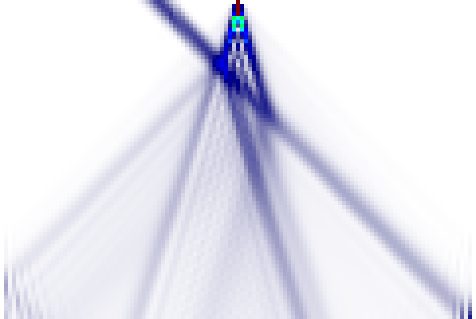

# tevo

`tevo` is a Rust program for the time evolution of two-dimensional quantum
systems on strongly interacting lattice models. The program is primarily meant
to simulate [quantum bowling](https://arxiv.org/abs/1302.2667) setups in two
dimensions.

It builds a sparse many-body Hamiltonian for a rectangular lattice, initializes a
localized wall plus an optional Gaussian wave packet, evolves the state in time,
and writes measurement data for site density, bond observables, cluster
densities, and optional state snapshots.

Supported model choices are:

- `tv`: spinless-fermion t/V model
- `tv-sym`: spinless-fermion t/V model with particle-hole symmetry
- `xxz`: Heisenberg spin-1/2 XXZ model

The following image shows an example of a space-time plot produced by
[example.sh](example.sh) for a 121 x 2 lattice where two particles at the center
of the system are hit by an incoming Gaussian wave packet.



## Building

To build the program, use:

```bash
cargo build --release
```

To build the program for hosts with the AVX instruction set enabled:

```bash
RUSTFLAGS='-C target-feature=+sse3,+avx' cargo build --release
```

To use the AVX2 instruction set:

```bash
RUSTFLAGS='-C target-feature=+sse3,+avx,+avx2' cargo build --release
```

## Usage

After building, run the release binary with:

```bash
target/release/tevo [OPTIONS]
```

For example:

```bash
target/release/tevo --model=tv --lattice-size=7,2 --simulation-time=10 --time-step=5E-4
```

The program creates an output directory named from the selected model and
couplings, such as `tv_tx-0.5_vx8_ty-0.5_vy1_s5e-4`. Existing output
directories are not overwritten unless `--force-overwrite` is passed.

Generated CSV metadata includes the hostname of the machine that ran the
simulation, so review output files before sharing them publicly.

General options:

```text
-h, --help                 Print help
    --version              Show version information
-v=N, --verbosity=N        Console verbosity: 0=silent, 1=default, 2=all
-j=N, --threads=N          Number of worker threads; omitted or 0 uses an estimate
-f, --force-overwrite      Overwrite files in an existing output directory
```

## Time Evolution

The simulation time grid is controlled by:

```text
--time-step=<float>             Time step, default 5E-4
--time-per-measurement=<float>  Time between measurements
-e, --simulation-time=<float>   End time, default 10
```

`--time-per-measurement` must be a multiple of `--time-step`.
`--simulation-time` must be a multiple of `--time-per-measurement`.

## Lattice and Model Setup

The lattice is rectangular with coordinates given as `x,y`. Horizontal bonds use
`tx` and `vx`; vertical bonds use `ty` and `vy`.

```text
--model=tv|tv-sym|xxz          Model type, default tv
--lattice-size=<int>,<int>     Lattice width and height, default 7,2
--periodic-in-x                Enable horizontal periodic boundary conditions
--periodic-in-y                Enable vertical periodic boundary conditions
--tx=<float>                   Horizontal hopping parameter, default -0.5
--vx=<float>                   Horizontal interaction parameter, default 8.0
--ty=<float>                   Vertical hopping parameter, default -0.5
--vy=<float>                   Vertical interaction parameter, default 1.0
```

## Initial State

By default, `tevo` constructs an initial state from a wall and an optional
Gaussian wave packet. The wall contributes fixed occupied sites. The Gaussian
sets the mobile component of the state; use `--gaussian-size=0,0` to disable it.

```text
--wall-start=<int>,<int>          Start site of the wall
--wall-size=<int>,<int>           Wall width and height
--extra-wall-sites=x,y;x,y;...    Additional wall sites
--gaussian-start=<int>,<int>      Start site of the Gaussian
--gaussian-size=<int>,<int>       Gaussian width and height
--gaussian-center=<float>         Gaussian center along x
--gaussian-momentum=<float>       Gaussian momentum, default -pi/2
--gaussian-sigma=<float>          Gaussian sigma, default 3
--initial-state-file=<state.bin>  Load the initial state from a saved binary state
```

The default wall starts at the middle x-coordinate and spans the lattice height.
The default Gaussian starts at `0,0` and extends up to the wall, capped at width
5.

## Output

Every full simulation writes CSV measurement files to the output directory:

- `site-measurements.csv`: site density by measurement time and lattice site
- `bond-measurements.csv`: hopping and interaction observables by bond
- `cluster-measurements.csv`: cluster density observables by site
- `info.csv`: lattice, basis, timing, norm, and Hamiltonian summary data

Image output is enabled by default in PNG format. Use:

```text
--image-format=png     Write PNG images, default
--image-format=svg     Write SVG images
--image-format=none    Disable image output
```

State and diagnostic output options:

```text
--save-states[=N,N,...]           Save all states, or only listed measurements
--save-most-occupied-states=<N>   Save the N most occupied basis states
--save-hamiltonian                Write hamilton-matrix.csv and exit
--save-basis                      Write basis.bin and exit
--predict-memory-usage            Estimate memory use and exit
--disable-interaction-offset      Disable automatic Hamiltonian trace minimization
```

Projection can be applied to the initial state before evolution:

```text
--projection-area=x0,y0;x1,y1
```

The two coordinates define the start and inclusive end point of the projection
area.

## License

This project is licensed under the MIT License. See [LICENSE](LICENSE).
